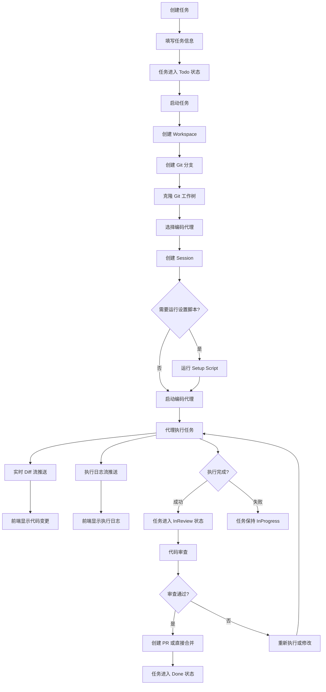

<p align="center">
  <a href="https://vibekanban.com">
    <picture>
      <source srcset="frontend/public/vibe-kanban-logo-dark.svg" media="(prefers-color-scheme: dark)">
      <source srcset="frontend/public/vibe-kanban-logo.svg" media="(prefers-color-scheme: light)">
      
    </picture>
  </a>
</p>

<p align="center">让 Claude Code、Gemini CLI、Codex、Amp 等编码代理的效率提升 10 倍...</p>
<p align="center">
  <a href="https://www.npmjs.com/package/vibe-kanban"></a>
  <a href="https://github.com/BloopAI/vibe-kanban/blob/main/.github/workflows/publish.yml"></a>
  <a href="https://deepwiki.com/BloopAI/vibe-kanban"></a>
</p>

<p align="center">
  <a href="README.md">English</a> |
  <strong>简体中文</strong>
</p>


## 📚 目录

- [项目概述](#项目概述)
- [核心功能](#核心功能)
- [技术架构](#技术架构)
- [业务流程](#业务流程)
- [快速开始](#快速开始)
- [开发指南](#开发指南)
- [项目结构](#项目结构)
- [支持的编码代理](#支持的编码代理)
- [贡献指南](#贡献指南)

## 项目概述

**Vibe Kanban** 是一个专为 AI 编码代理设计的任务编排和管理平台。随着 AI 编码代理越来越多地参与代码编写工作，人类工程师的角色正在转变为任务规划、代码审查和工作流编排。Vibe Kanban 正是为了简化这一过程而生。

### 为什么需要 Vibe Kanban？

在现代软件开发中，AI 编码代理（如 Claude Code、Cursor、Gemini 等）已经成为重要的生产力工具。然而，管理多个代理、追踪任务进度、审查代码变更、处理分支冲突等工作仍然繁琐。Vibe Kanban 提供了：

- 🎯 **统一的任务管理界面** - 使用看板视图管理所有编码任务
- 🤖 **多代理支持** - 在同一项目中无缝切换不同的 AI 编码代理
- 🔄 **并行与串行编排** - 同时运行多个任务或按顺序执行
- 👀 **实时代码审查** - 实时查看代理的代码变更和 Diff
- 🌲 **Git 分支隔离** - 每个任务自动创建独立的工作空间和分支
- 📊 **执行过程追踪** - 完整记录代理的执行日志和状态
- 🚀 **一键 PR 创建** - 直接从界面创建和管理 GitHub Pull Request
- ⚙️ **集中配置管理** - 统一管理 MCP（Model Context Protocol）服务器配置

## 核心功能

### 1. 任务编排与管理

- **看板视图**：使用直观的 Kanban 看板管理任务状态（Todo → 进行中 → 审查中 → 完成/取消）
- **任务层级**：支持父子任务关系，便于组织复杂的开发工作
- **任务共享**：与团队成员分享任务，支持远程任务链接和分配
- **草稿管理**：保存草稿任务和后续消息，稍后继续工作
- **标签系统**：为任务添加标签，方便分类和搜索

### 2. 多代理支持

支持主流的 AI 编码代理：

| 代理名称 | 说明 |
|---------|------|
| **Claude Code** | Anthropic 的官方 IDE 扩展 |
| **Amp** | Anthropic Amp 编码助手 |
| **Gemini** | Google Gemini CLI |
| **Cursor** | Cursor IDE 集成 |
| **Codex** | OpenAI Codex |
| **Qwen Code** | 阿里云通义千问代码助手 |
| **Droid** | Android AI 代理 |

每个代理都支持：
- 独立的会话管理
- 日志规范化显示
- MCP 配置集成
- 审批工作流

### 3. 工作空间与分支管理

- **独立工作空间**：每个任务尝试创建独立的工作空间（Workspace）
- **Git 工作树**：使用 Git worktree 为每个任务创建隔离的文件系统
- **自动分支创建**：自动生成以 `claude/` 或 `vibe/` 开头的任务分支
- **分支清理**：自动清理孤立的工作树和临时分支
- **冲突解决**：内置 Git 冲突解决工具

### 4. 实时代码审查

- **Diff 流**：实时监控文件系统变化，生成增量 Diff
- **代码差异视图**：使用专业的 Diff 查看器（基于 @git-diff-view/react）
- **文件变更追踪**：追踪每个文件的修改、新增、删除
- **变更统计**：显示添加/删除的行数统计
- **WebSocket 实时推送**：代码变更实时推送到前端

### 5. GitHub 集成

- **PR 创建**：直接从任务创建 Pull Request
- **PR 合并**：支持合并、Squash、Rebase 等合并策略
- **状态检查**：监控 PR 的 CI/CD 状态
- **评论管理**：查看和回复 PR 评论
- **直接合并**：支持跳过 PR 直接合并到目标分支

### 6. 组织与团队协作

- **组织管理**：创建和管理开发组织
- **成员邀请**：通过邀请链接添加团队成员
- **角色控制**：管理员、成员等不同角色权限
- **项目共享**：在组织内共享项目和配置

### 7. 审批工作流

- **工具调用审批**：在代理执行某些敏感操作前需要人工审批
- **条件审批**：根据操作类型和上下文设置审批规则
- **审批历史**：记录所有审批决策和时间

### 8. 远程部署支持

- **SSH 集成**：在远程服务器上运行 Vibe Kanban
- **远程编辑器**：通过 SSH 在本地编辑器中打开远程项目
- **隧道支持**：支持 Cloudflare Tunnel、ngrok 等服务

## 技术架构

Vibe Kanban 采用现代化的全栈架构，前后端分离，具有高性能和可扩展性。

### 整体架构图

```
┌─────────────────────────────────────────────────────────────┐
│                        前端层 (React)                        │
│  ┌─────────────┬─────────────┬─────────────┬──────────────┐ │
│  │  看板视图    │  代码审查   │   设置页面   │  执行日志     │ │
│  └─────────────┴─────────────┴─────────────┴──────────────┘ │
│  ┌──────────────────────────────────────────────────────┐   │
│  │  状态管理 (Zustand + TanStack Query)                  │   │
│  └──────────────────────────────────────────────────────┘   │
│  ┌──────────────────────────────────────────────────────┐   │
│  │  WebSocket 客户端 (实时事件、Diff 流、日志流)          │   │
│  └──────────────────────────────────────────────────────┘   │
└──────────────────────┬──────────────────────────────────────┘
                       │ HTTP/WebSocket
┌──────────────────────┴──────────────────────────────────────┐
│                   后端层 (Rust + Axum)                       │
│  ┌─────────────────────────────────────────────────────────┐│
│  │                    API 路由层                            ││
│  │  /projects  /tasks  /task_attempts  /shared_tasks  等   ││
│  └─────────────────────────────────────────────────────────┘│
│  ┌─────────────────────────────────────────────────────────┐│
│  │                   服务层 (Services)                      ││
│  │  Container  Git  GitHub  DiffStream  Approvals  等      ││
│  └─────────────────────────────────────────────────────────┘│
│  ┌─────────────────────────────────────────────────────────┐│
│  │              执行器层 (Executors)                        ││
│  │  ClaudeCode  Amp  Gemini  Cursor  Codex  等            ││
│  └─────────────────────────────────────────────────────────┘│
│  ┌─────────────────────────────────────────────────────────┐│
│  │                数据访问层 (DB Models)                    ││
│  │  Task  Workspace  Session  ExecutionProcess  等         ││
│  └─────────────────────────────────────────────────────────┘│
└──────────────────────┬──────────────────────────────────────┘
                       │ SQLx
┌──────────────────────┴──────────────────────────────────────┐
│                   数据库层 (SQLite)                          │
│  Projects  Tasks  Workspaces  Sessions  ExecutionProcesses  │
└─────────────────────────────────────────────────────────────┘
```

### 前端技术栈

**核心框架**：
- **React 18.2** - UI 框架
- **TypeScript 5.9** - 类型安全
- **Vite 6.3** - 构建工具
- **React Router 6.8** - 路由管理

**状态管理**：
- **Zustand 4.5** - 轻量级状态管理
- **TanStack React Query 5.85** - 服务端状态管理和缓存
- **TanStack React Form 1.23** - 表单状态管理

**UI 组件**：
- **Radix UI** - 无障碍的基础组件
- **Shadcn UI** - 精美的组件库
- **Tailwind CSS 3.4** - 实用优先的 CSS 框架
- **Framer Motion 12.23** - 动画库

**代码编辑器与 Diff**：
- **CodeMirror** - 代码编辑器
- **@git-diff-view/react 0.0.30** - Git 差异视图
- **@uiw/react-codemirror 4.25** - React CodeMirror 封装

**富文本编辑**：
- **Lexical 0.36** - Facebook 的现代富文本编辑器

**本地数据库**：
- **wa-sqlite 1.0** - WebAssembly SQLite
- **TanStack Electric DB** - 实时数据同步

**其他工具**：
- **i18next 25.5** - 国际化
- **react-hotkeys-hook 5.1** - 键盘快捷键
- **PostHog 1.276** - 产品分析
- **Sentry React 9.34** - 错误监控

### 后端技术栈

**核心框架**：
- **Rust** - 系统编程语言，性能卓越
- **Axum** - 基于 Tokio 的现代 Web 框架
- **Tokio** - 异步运行时

**数据库**：
- **SQLx 0.8.6** - 编译时 SQL 验证
- **SQLite** - 轻量级嵌入式数据库
- **Diesel** (部分) - ORM 支持

**序列化与类型**：
- **Serde** - 序列化/反序列化
- **ts-rs** - 从 Rust 生成 TypeScript 类型

**Git 操作**：
- **git2 0.18** - libgit2 的 Rust 绑定

**进程管理**：
- **nix 0.29** - Unix 系统调用

**MCP 支持**：
- **rmcp 0.5.0** - Model Context Protocol 实现

**监控与日志**：
- **Tracing** - 结构化日志和追踪
- **Sentry** - 错误报告

**HTTP 客户端**：
- **reqwest** - HTTP 客户端

### 数据模型

核心实体及其关系：

```
Project (项目)
  ├─ 1:N → Task (任务)
  │         ├─ 1:N → Workspace (工作空间/任务尝试)
  │         │         ├─ 1:N → Session (代理会话)
  │         │         │         └─ 1:N → ExecutionProcess (执行过程)
  │         │         │                   └─ 1:N → CodingAgentTurn (对话回合)
  │         │         └─ 1:N → WorkspaceRepo (工作空间仓库)
  │         ├─ 1:N → TaskImage (任务图片)
  │         └─ 0:1 → SharedTask (共享任务)
  ├─ 1:N → ProjectRepo (项目仓库)
  └─ 0:1 → Organization (组织)

User (用户)
  ├─ 1:N → Project
  └─ 1:N → OrganizationMember (组织成员)

Repo (版本库)
  ├─ 1:N → ProjectRepo
  └─ 1:N → WorkspaceRepo

Scratch (草稿)
  └─ DraftTask | DraftFollowUp
```

主要实体说明：

- **Project**: 代表一个软件项目，包含多个任务
- **Task**: 具体的开发任务，有状态流转（todo → inprogress → inreview → done/cancelled）
- **Workspace**: 任务的一次执行尝试，创建独立的工作空间和分支
- **Session**: 编码代理的会话，一个工作空间可以有多个会话（切换代理）
- **ExecutionProcess**: 具体的执行过程（安装脚本、编码代理、清理脚本等）
- **CodingAgentTurn**: 代理的对话回合，记录提示和响应
- **Repo**: Git 仓库，一个项目可以包含多个仓库（monorepo 支持）

## 业务流程

### 1. 任务创建与执行流程



### 2. 实时 Diff 流工作原理

```
┌─────────────────────────────────────────────────────────┐
│  编码代理修改文件                                         │
└────────────────┬────────────────────────────────────────┘
                 │
                 ▼
┌─────────────────────────────────────────────────────────┐
│  DiffStream 服务监控文件系统变化 (inotify/FSEvents)      │
│  - 监听工作空间目录                                       │
│  - 检测文件创建、修改、删除                               │
└────────────────┬────────────────────────────────────────┘
                 │
                 ▼
┌─────────────────────────────────────────────────────────┐
│  生成 Git Diff                                           │
│  - 使用 git diff 命令                                    │
│  - 支持增量 Diff（只发送变化部分）                        │
│  - 限制最大 Diff 大小（200MB）                           │
└────────────────┬────────────────────────────────────────┘
                 │
                 ▼
┌─────────────────────────────────────────────────────────┐
│  WebSocket 推送到前端                                    │
│  - 实时推送 Diff 块                                      │
│  - 推送文件变更事件                                      │
└────────────────┬────────────────────────────────────────┘
                 │
                 ▼
┌─────────────────────────────────────────────────────────┐
│  前端 Diff 视图渲染                                      │
│  - 使用 @git-diff-view/react                            │
│  - 高亮显示添加/删除/修改                                 │
│  - 支持文件级导航                                        │
└─────────────────────────────────────────────────────────┘
```

### 3. 多代理编排流程

**并行执行**：
```
任务 A (Claude Code) ──┐
                      ├──→ 同时执行 ──→ 审查 ──→ 合并
任务 B (Gemini CLI)   ──┘
```

**串行执行**：
```
任务 A (Claude Code) → 完成 → 任务 B (Cursor) → 完成 → 合并
```

**父子任务关系**：
```
父任务：重构认证系统
  ├─ 子任务 1：更新登录组件 (Claude Code)
  ├─ 子任务 2：重写 API 端点 (Gemini CLI)
  └─ 子任务 3：更新测试 (Cursor)
```

### 4. Git 工作流

```
主分支 (main)
  │
  ├─ 任务分支 1: claude/add-auth-feature-ABC123
  │   └─ 工作树 1: /path/to/worktree-1/
  │
  ├─ 任务分支 2: vibe/fix-bug-DEF456
  │   └─ 工作树 2: /path/to/worktree-2/
  │
  └─ 任务分支 3: claude/refactor-api-GHI789
      └─ 工作树 3: /path/to/worktree-3/
```

每个任务获得：
- 独立的 Git 分支
- 独立的文件系统目录（worktree）
- 隔离的代码变更
- 独立的提交历史

### 5. 审批工作流

```
┌─────────────────────────────────────────┐
│  编码代理请求执行敏感操作                │
│  (如删除文件、运行系统命令等)            │
└────────────┬────────────────────────────┘
             │
             ▼
┌─────────────────────────────────────────┐
│  检查审批规则                            │
│  - 是否需要审批？                        │
│  - 审批类型（自动/手动）                 │
└────────────┬────────────────────────────┘
             │
     ┌───────┴───────┐
     │               │
     ▼               ▼
  需要审批        无需审批
     │               │
     ▼               │
┌─────────────┐      │
│  创建审批请求 │      │
│  推送到前端  │      │
└────┬────────┘      │
     │               │
     ▼               │
┌─────────────┐      │
│  用户审批    │      │
│  批准/拒绝  │      │
└────┬────────┘      │
     │               │
     └───────┬───────┘
             │
             ▼
┌─────────────────────────────────────────┐
│  执行或拒绝操作                          │
│  记录审批历史                            │
└─────────────────────────────────────────┘
```

### 6. PR 创建与合并流程

```
┌─────────────────────────────────────────┐
│  任务完成，代码审查通过                  │
└────────────┬────────────────────────────┘
             │
             ▼
┌─────────────────────────────────────────┐
│  选择合并方式                            │
│  1. 创建 PR                             │
│  2. 直接合并                            │
└────────────┬────────────────────────────┘
             │
     ┌───────┴───────┐
     │               │
     ▼               ▼
┌─────────────┐  ┌─────────────┐
│  创建 PR     │  │  直接合并    │
│  - 标题     │  │  - 目标分支  │
│  - 描述     │  │  - 合并提交  │
│  - 审查者   │  └──────┬──────┘
└────┬────────┘         │
     │                  │
     ▼                  │
┌─────────────┐         │
│  GitHub PR  │         │
│  - CI/CD    │         │
│  - 代码审查 │         │
└────┬────────┘         │
     │                  │
     ▼                  │
┌─────────────┐         │
│  合并 PR    │         │
│  - Merge    │         │
│  - Squash   │         │
│  - Rebase   │         │
└────┬────────┘         │
     │                  │
     └────────┬─────────┘
              │
              ▼
┌─────────────────────────────────────────┐
│  更新主分支                              │
│  记录 Merge 信息                        │
│  清理工作树和分支                        │
└─────────────────────────────────────────┘
```

## 快速开始

### 前置要求

- **Git** - 版本控制系统
- 已认证的编码代理（Claude Code、Cursor、Gemini 等任意一个）

### 安装与运行

最简单的方式是使用 npx：

```bash
npx vibe-kanban
```

首次运行会：
1. 下载并安装 Vibe Kanban
2. 初始化本地数据库
3. 自动打开浏览器
4. 显示项目列表和看板

### 基本使用流程

1. **添加项目**
   - 点击"Add Project"
   - 选择 Git 仓库目录
   - 配置项目设置（可选）

2. **创建任务**
   - 进入项目看板
   - 点击"Create Task"
   - 填写任务标题和描述
   - 可添加图片、标签等

3. **执行任务**
   - 点击任务卡片
   - 选择编码代理（如 Claude Code）
   - 点击"Start"
   - 实时查看代码变更和执行日志

4. **审查与合并**
   - 查看代码 Diff
   - 处理 Git 冲突（如有）
   - 创建 PR 或直接合并
   - 任务标记为完成

### 视频教程

观看完整的功能演示：[YouTube 视频](https://youtu.be/TFT3KnZOOAk)

## 开发指南

### 前置要求

- [Rust](https://rustup.rs/) (最新稳定版)
- [Node.js](https://nodejs.org/) (>=18)
- [pnpm](https://pnpm.io/) (>=8)

额外的开发工具：
```bash
cargo install cargo-watch
cargo install sqlx-cli
```

### 安装依赖

```bash
pnpm i
```

### 运行开发服务器

启动前端和后端（端口自动分配）：

```bash
pnpm run dev
```

这会：
- 启动后端服务器（自动分配端口）
- 启动前端开发服务器
- 从 `dev_assets_seed` 复制一个空白数据库

只启动后端（监视模式）：

```bash
pnpm run backend:dev:watch
```

只启动前端：

```bash
pnpm run frontend:dev
```

### 类型检查

前端类型检查：
```bash
pnpm run check
```

后端 Rust 检查：
```bash
pnpm run backend:check
# 或
cargo check --workspace
```

### 运行测试

Rust 测试：
```bash
cargo test --workspace
```

前端测试：
```bash
cd frontend
pnpm test
```

### 生成 TypeScript 类型

从 Rust 结构体生成 TypeScript 类型：

```bash
pnpm run generate-types
```

CI 中验证类型是否同步：
```bash
pnpm run generate-types:check
```

### 数据库操作

准备 SQLx 离线模式数据（本地开发）：
```bash
pnpm run prepare-db
```

准备远程部署的数据库：
```bash
pnpm run remote:prepare-db
```

### 从源码构建（macOS）

```bash
./local-build.sh
```

测试构建：
```bash
cd npx-cli && node bin/cli.js
```

### 环境变量

| 变量 | 类型 | 默认值 | 说明 |
|------|------|--------|------|
| `POSTHOG_API_KEY` | 构建时 | 空 | PostHog 分析 API 密钥 |
| `POSTHOG_API_ENDPOINT` | 构建时 | 空 | PostHog 端点 |
| `PORT` | 运行时 | 自动分配 | **生产环境**：服务器端口；**开发环境**：前端端口 |
| `BACKEND_PORT` | 运行时 | `0` | 后端端口（仅开发模式） |
| `FRONTEND_PORT` | 运行时 | `3000` | 前端端口（仅开发模式） |
| `HOST` | 运行时 | `127.0.0.1` | 后端服务器主机 |
| `DISABLE_WORKTREE_ORPHAN_CLEANUP` | 运行时 | 未设置 | 禁用工作树清理（调试用） |

## 项目结构

```
vibe-kanban/
├── crates/                         # Rust 工作空间
│   ├── server/                     # API 服务器和二进制文件
│   │   ├── src/
│   │   │   ├── main.rs            # 服务器入口
│   │   │   ├── routes/            # API 路由
│   │   │   └── bin/               # 其他二进制工具
│   │   └── Cargo.toml
│   ├── db/                         # 数据库模型和迁移
│   │   ├── src/models/            # SQLx 模型
│   │   ├── migrations/            # SQL 迁移文件
│   │   └── Cargo.toml
│   ├── services/                   # 业务逻辑服务
│   │   ├── src/services/
│   │   │   ├── container.rs       # 工作空间管理
│   │   │   ├── git.rs             # Git 操作
│   │   │   ├── github.rs          # GitHub 集成
│   │   │   ├── diff_stream.rs     # Diff 流
│   │   │   └── ...
│   │   └── Cargo.toml
│   ├── executors/                  # 编码代理执行器
│   │   ├── src/executors/
│   │   │   ├── claude_code.rs     # Claude Code
│   │   │   ├── gemini.rs          # Gemini
│   │   │   └── ...
│   │   └── Cargo.toml
│   ├── utils/                      # 工具函数
│   ├── deployment/                 # 部署相关
│   ├── local-deployment/           # 本地部署
│   └── remote/                     # 远程部署
│
├── frontend/                       # React 前端应用
│   ├── src/
│   │   ├── App.tsx                # 应用入口
│   │   ├── pages/                 # 页面组件
│   │   │   ├── Projects.tsx       # 项目列表
│   │   │   ├── ProjectTasks.tsx   # 任务看板
│   │   │   ├── FullAttemptLogs.tsx # 执行日志
│   │   │   └── settings/          # 设置页面
│   │   ├── components/            # UI 组件
│   │   │   ├── dialogs/           # 对话框组件
│   │   │   ├── panels/            # 侧边栏面板
│   │   │   ├── tasks/             # 任务相关组件
│   │   │   └── ...
│   │   ├── contexts/              # React Context
│   │   ├── hooks/                 # 自定义 Hooks
│   │   ├── lib/                   # 工具库
│   │   └── stores/                # Zustand 状态
│   ├── public/                    # 静态资源
│   └── package.json
│
├── remote-frontend/                # 远程部署前端
├── shared/                         # 共享类型
│   └── types.ts                   # 生成的 TS 类型（勿手动编辑）
├── assets/                         # 打包资源
├── dev_assets/                     # 开发资产
├── dev_assets_seed/                # 开发种子数据
├── npx-cli/                        # NPM CLI 包
├── scripts/                        # 开发脚本
├── docs/                           # 文档
├── CLAUDE.md                       # 项目指南
└── package.json                    # 根 package.json
```

### 关键文件说明

| 文件/目录 | 说明 |
|----------|------|
| `crates/server/src/main.rs` | 后端服务器入口，设置 Axum 路由 |
| `crates/db/migrations/` | 数据库迁移文件，定义数据库结构 |
| `crates/services/src/services/` | 核心业务逻辑 |
| `crates/executors/src/executors/` | 各个编码代理的实现 |
| `frontend/src/App.tsx` | 前端应用入口，设置路由和 Context |
| `frontend/src/pages/ProjectTasks.tsx` | 任务看板主界面 |
| `frontend/src/components/NormalizedConversation/` | 执行日志规范化显示 |
| `shared/types.ts` | 从 Rust 生成的 TypeScript 类型定义 |
| `scripts/setup-dev-environment.js` | 开发环境设置脚本 |

## 支持的编码代理

| 代理 | 状态 | 说明 | 配置方式 |
|------|------|------|---------|
| **Claude Code** | ✅ 完全支持 | Anthropic 官方 IDE 扩展 | 需要 Claude Code CLI |
| **Amp** | ✅ 完全支持 | Anthropic Amp 编码助手 | 需要 Amp CLI |
| **Gemini** | ✅ 完全支持 | Google Gemini CLI | 需要 Gemini CLI |
| **Cursor** | ✅ 完全支持 | Cursor IDE 集成 | 需要 Cursor 应用 |
| **Codex** | ✅ 完全支持 | OpenAI Codex | 需要 API 密钥 |
| **Qwen Code** | ✅ 完全支持 | 阿里云通义千问 | 需要通义千问 CLI |
| **Droid** | ⚠️ 实验性 | Android AI 代理 | 需要 Droid CLI |

完整的代理列表和配置指南请查看[官方文档](https://vibekanban.com/docs)。

## 贡献指南

我们欢迎社区贡献！在提交 PR 之前，请：

1. **先讨论**：通过 [GitHub Discussions](https://github.com/BloopAI/vibe-kanban/discussions) 或 [Discord](https://discord.gg/AC4nwVtJM3) 与核心团队讨论您的想法
2. **了解路线图**：确保您的提议与现有路线图一致
3. **遵循编码规范**：
   - Rust：使用 `rustfmt`（`cargo fmt`）
   - TypeScript：使用 ESLint 和 Prettier（`pnpm run lint`）
4. **添加测试**：为新功能添加适当的测试
5. **更新文档**：如果改变了 API 或行为，请更新相关文档

### 编码规范

**Rust**：
- 使用 `rustfmt.toml` 配置
- 按 crate 分组导入
- 模块名使用 snake_case
- 类型名使用 PascalCase
- 添加 `#[derive(Debug, Serialize, Deserialize)]` 等 trait

**TypeScript/React**：
- 使用 ESLint + Prettier
- 2 空格缩进
- 单引号
- 80 列宽度
- 组件名使用 PascalCase
- 变量/函数名使用 camelCase
- 文件名使用 kebab-case（如适用）

### 提交流程

1. Fork 仓库
2. 创建功能分支（`git checkout -b feature/amazing-feature`）
3. 提交更改（`git commit -m 'Add amazing feature'`）
4. 推送到分支（`git push origin feature/amazing-feature`）
5. 打开 Pull Request

## 支持与反馈

- **功能请求**：通过 [GitHub Discussions](https://github.com/BloopAI/vibe-kanban/discussions) 创建讨论
- **Bug 报告**：在 GitHub 上[提交 Issue](https://github.com/BloopAI/vibe-kanban/issues)
- **社区讨论**：加入我们的 [Discord 服务器](https://discord.gg/AC4nwVtJM3)
- **文档**：访问[官方文档网站](https://vibekanban.com/docs)

## 远程部署

Vibe Kanban 支持在远程服务器上运行：

1. **暴露 Web UI**：使用 Cloudflare Tunnel、ngrok 或其他隧道服务
2. **配置 SSH**：在设置 → 编辑器集成中配置远程 SSH 主机和用户
3. **前置条件**：
   - 从本地到远程服务器的 SSH 访问
   - 配置 SSH 密钥（无密码认证）
   - 安装 VSCode Remote-SSH 扩展

配置完成后，"在 VSCode 中打开"按钮将生成 `vscode://vscode-remote/ssh-remote+user@host/path` 格式的 URL，自动在本地编辑器中打开远程项目。

详细设置说明请查看[官方文档](https://vibekanban.com/docs/configuration-customisation/global-settings#remote-ssh-configuration)。

## 许可证

请参阅 [LICENSE](LICENSE) 文件了解详细信息。

## 致谢

Vibe Kanban 由 [Bloop AI](https://bloop.ai/) 团队开发，感谢所有贡献者和社区成员的支持！

---

<p align="center">
  Made with ❤️ by the Vibe Kanban team
</p>

<p align="center">
  <a href="https://vibekanban.com">Website</a> •
  <a href="https://vibekanban.com/docs">Documentation</a> •
  <a href="https://discord.gg/AC4nwVtJM3">Discord</a> •
  <a href="https://github.com/BloopAI/vibe-kanban/discussions">Discussions</a>
</p>
