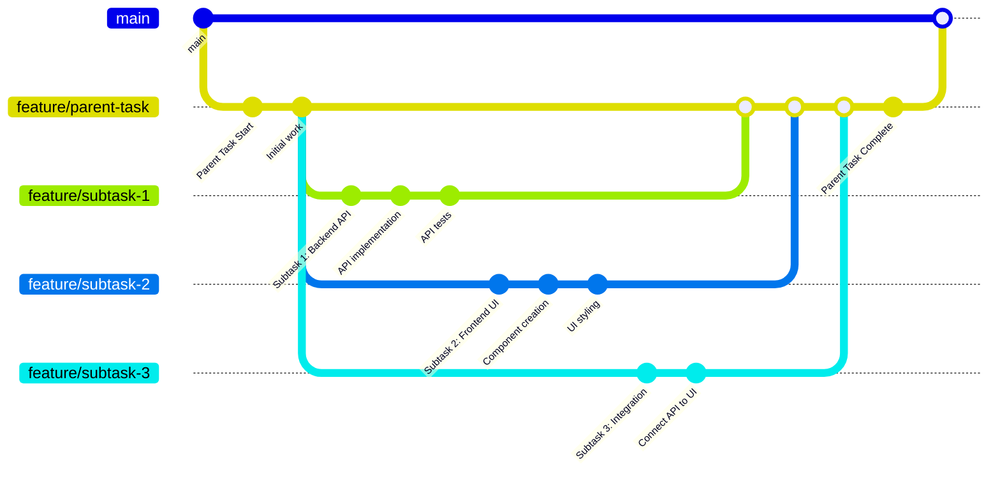

子任务允许您将复杂任务分解为更小、更易管理的部分。每个子任务都链接到特定的任务尝试，并继承相同的项目和分支上下文。

## 创建子任务

<Frame>

</Frame>

从现有任务尝试创建子任务：

<Steps>
<Step title="导航到任务尝试">
  打开您想要创建子任务的任务。
</Step>

<Step title="点击创建子任务">
  点击任务右上角的三点图标，然后选择**创建子任务**。
</Step>

<Step title="填写子任务详情">
  任务创建对话框将打开，父任务尝试和基础分支已自动设置。添加您的子任务标题和描述。
</Step>

<Step title="保存子任务">
  点击**保存**创建子任务。它将作为新任务出现在您的看板上。
</Step>
</Steps>

<Note>
当您创建子任务时，它会自动从父任务尝试继承基础分支，确保开发工作流程的一致性。
</Note>

## 查看包含子任务的任务

<Frame>

</Frame>

查看父任务时，您可以在**任务关系**面板中看到其子任务。这个可折叠部分显示：

- 带有计数的**子任务**（例如，"子任务 (1)"）
- 带有链接的单个子任务标题以查看它们
- 父任务和子任务之间的轻松导航

这有助于您跟踪所有相关工作项的进度，并一目了然地了解任务层次结构。

## 查看子任务详情

<Frame>

</Frame>

查看子任务时，**任务关系**面板显示：

- 显示父任务标题的**父任务**部分
- 导航到父任务的直接链接
- 清晰的视觉指示表明这是一个子任务
- 关于父子关系的上下文

子任务还显示自己的**创建子任务**按钮，允许您在需要时创建嵌套子任务。

## 子任务的工作方式

Vibe Kanban 中的子任务遵循以下关键原则：

### Git 分支工作流程

子任务创建自己的功能分支，可以独立工作，同时保持与父任务的连接：

### 父子关系

- 子任务链接到特定的**任务尝试**，而不仅仅是任务
- 每个子任务都知道是哪个尝试创建的
- 可以从同一个父尝试创建多个子任务

### 分支继承

- 子任务自动从父尝试继承基础分支
- 这确保子任务在相同的开发上下文中工作
- 如果需要，您可以在创建子任务时修改分支

### 独立的任务生命周期

- 子任务在看板上显示为常规任务
- 每个子任务都有自己的生命周期（待办 → 进行中 → 审查中 → 完成）
- 子任务可以有自己的任务尝试和编程代理
