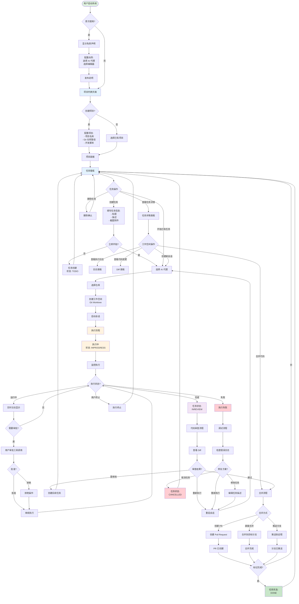
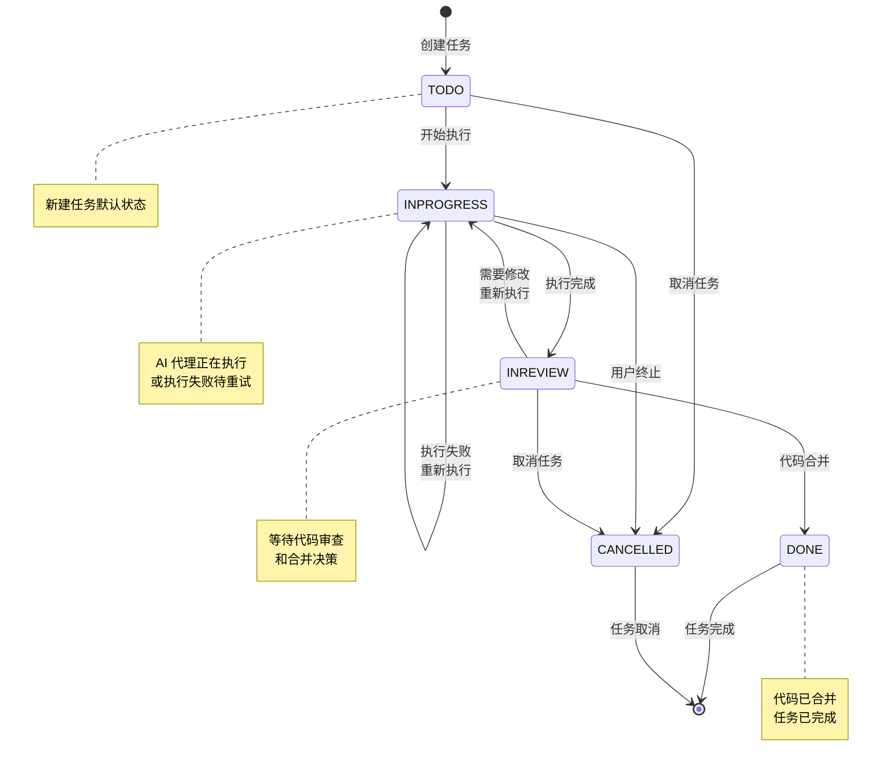
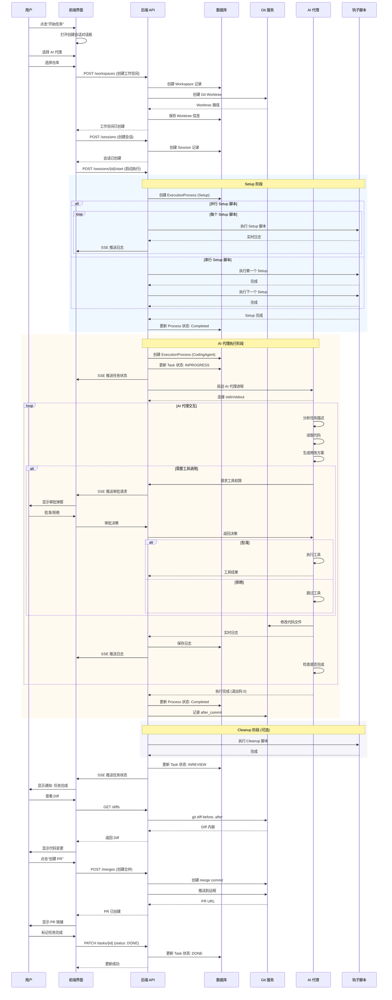
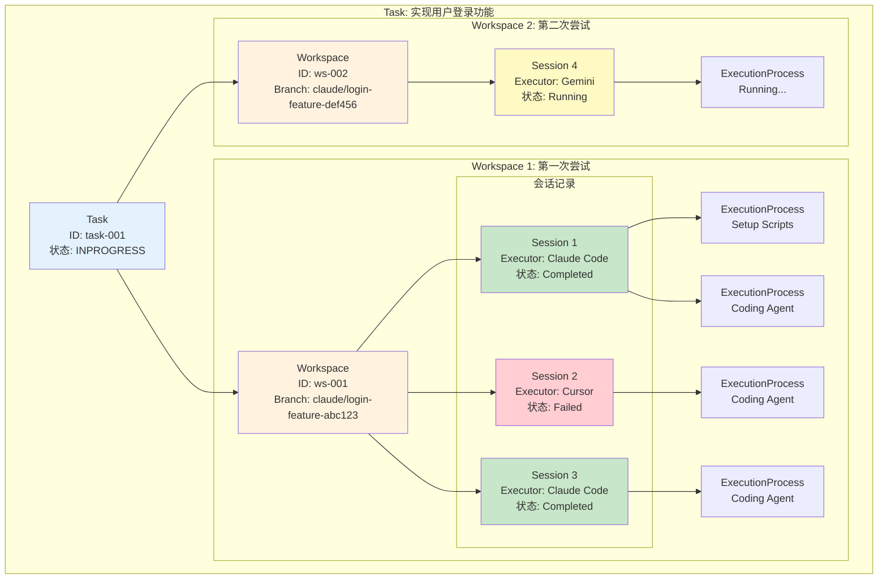
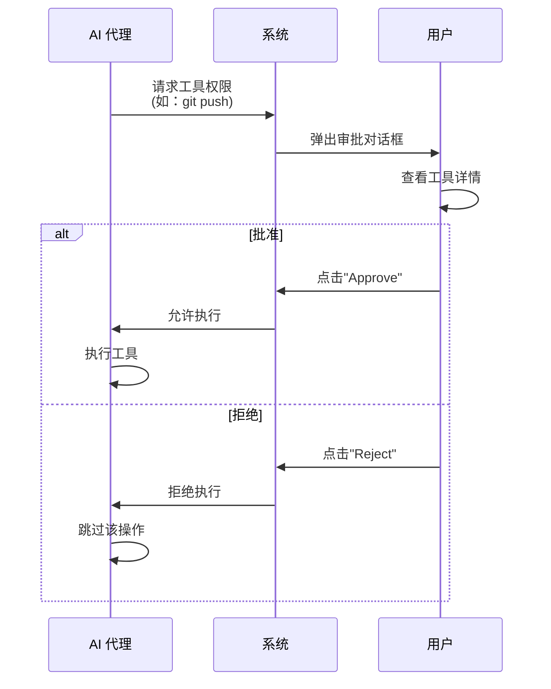
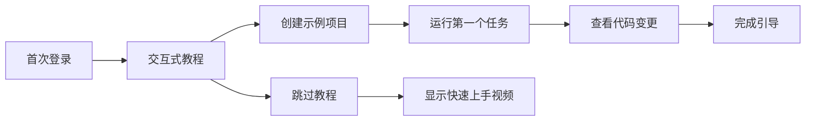
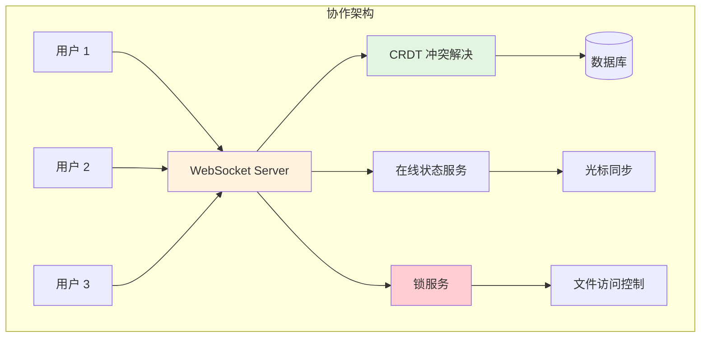
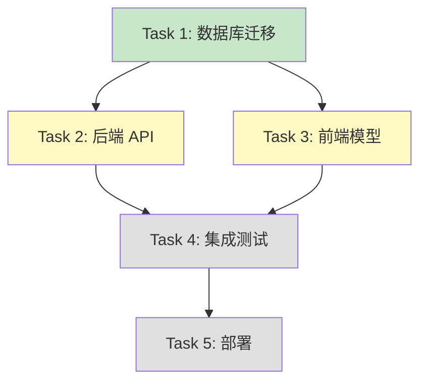
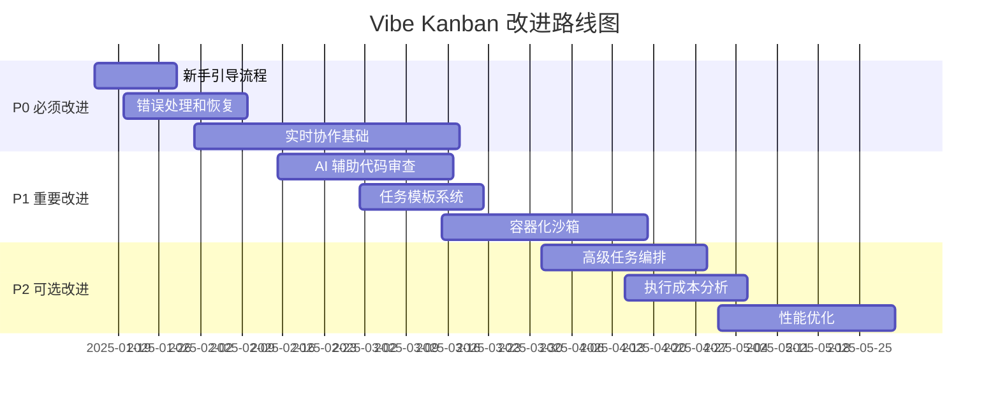

# Vibe Kanban 系统业务使用说明

## 目录

- [1. 系统概述](#1-系统概述)
- [2. 用户角色与权限](#2-用户角色与权限)
- [3. 核心业务流程](#3-核心业务流程)
- [4. 详细操作指南](#4-详细操作指南)
- [5. 流程不足与改进建议](#5-流程不足与改进建议)

---

## 1. 系统概述

### 1.1 系统定位

Vibe Kanban 是一个 **AI 编码代理任务编排平台**，帮助开发者管理和协调多个 AI 编码助手（如 Claude Code、Cursor、Copilot 等）同时工作。

### 1.2 核心功能

| 功能模块 | 描述 |
|---------|------|
| **项目管理** | 管理代码项目，支持多仓库配置 |
| **任务编排** | Kanban 看板管理任务生命周期 |
| **AI 代理执行** | 选择并执行 9+ 种 AI 编码代理 |
| **隔离环境** | 基于 Git Worktree 的独立工作空间 |
| **代码审查** | 实时查看代码变更和 Diff |
| **审批流程** | 控制 AI 代理的操作权限 |
| **团队协作** | 任务共享和远程协作 |

### 1.3 支持的 AI 代理

- **Claude Code** (Anthropic)
- **Cursor Agent**
- **GitHub Copilot**
- **Gemini CLI** (Google)
- **Codex** (OpenAI)
- **Amp**
- **Droid AI**
- **Qwen Code**
- **Opencode**

---

## 2. 用户角色与权限

### 2.1 本地部署模式

| 角色 | 权限 | 说明 |
|------|------|------|
| **单用户** | 全部权限 | 本地 SQLite，完全控制 |

### 2.2 远程部署模式

| 角色 | 权限 | 说明 |
|------|------|------|
| **组织所有者** | 完全管理权限 | 创建项目、邀请成员、管理配置 |
| **组织成员** | 项目操作权限 | 创建任务、执行 AI 代理、查看代码 |
| **访客** | 只读权限 | 查看共享任务 |

> ⚠️ **当前限制**：远程模式缺少细粒度的 RBAC（基于角色的访问控制）

---

## 3. 核心业务流程

### 3.1 总体业务流程图



### 3.2 任务状态流转图



### 3.3 AI 代理执行流程详解



### 3.4 工作空间（Workspace）与会话（Session）关系



**说明**：
- **Task（任务）**：用户要完成的工作项
- **Workspace（工作空间）**：一个独立的 Git Worktree，对应一次完整的任务尝试
- **Session（会话）**：在工作空间内使用特定 AI 代理的一次执行
- **ExecutionProcess（执行进程）**：会话中的具体执行步骤（Setup、Coding Agent、Cleanup、DevServer）

---

## 4. 详细操作指南

### 4.1 首次启动

#### 4.1.1 安装和启动

**本地部署**：
```bash
# 方式 1：使用 NPX（推荐）
npx vibe-kanban

# 方式 2：全局安装
npm install -g vibe-kanban
vibe-kanban

# 方式 3：从源码构建
git clone https://github.com/your-org/vibe-kanban.git
cd vibe-kanban
pnpm install
pnpm run dev
```

系统将自动：
1. 下载平台相关的二进制文件
2. 启动后端服务（默认端口：自动分配）
3. 启动前端开发服务器
4. 打开浏览器访问 `http://localhost:<port>`

#### 4.1.2 初始化向导

**步骤 1：免责声明**
- 阅读并接受使用条款
- 了解 AI 代理的风险和限制

**步骤 2：选择 AI 代理**
- 选择默认使用的 AI 编码代理
- 支持的选项：
  - Claude Code（推荐，功能最完整）
  - Cursor Agent
  - GitHub Copilot
  - Gemini CLI
  - 等等...

**步骤 3：配置编辑器**
- 选择代码编辑器：
  - VS Code（推荐）
  - Cursor
  - 其他

**步骤 4：查看发布说明**
- 了解最新功能和变更

### 4.2 项目管理

#### 4.2.1 创建项目

**操作路径**：项目列表页 → 点击"+ New Project"

**配置项**：

| 字段 | 说明 | 示例 |
|------|------|------|
| **项目名称** | 项目的显示名称 | `我的 Web 应用` |
| **Git 仓库** | 添加一个或多个 Git 仓库 | `/Users/john/projects/my-app` |
| **默认工作目录** | AI 代理的默认工作目录（可选） | `packages/backend` |
| **Setup 脚本** | 任务启动前执行的脚本（可选） | `npm install` |
| **Cleanup 脚本** | 任务完成后执行的脚本（可选） | `npm run lint` |
| **Dev Server 脚本** | 持久化开发服务器（可选） | `npm run dev` |

**多仓库配置**：
- 点击"Add Repository"添加多个仓库
- 适用于微服务架构或 Monorepo

#### 4.2.2 项目设置

**操作路径**：项目列表 → 点击项目卡片的设置图标

**可配置项**：
- 修改项目名称
- 添加/删除 Git 仓库
- 配置开发脚本
- 设置默认 AI 代理
- 配置 MCP 服务器
- 删除项目

### 4.3 任务管理

#### 4.3.1 创建任务

**操作路径**：任务看板 → 点击"+ Create Task"

**创建方式 1：仅创建任务**

```
1. 填写任务标题（必填）
2. 填写任务描述（可选，支持 Markdown）
3. 上传截图（可选）
4. 点击"Create Task"
```

任务创建后进入 **TODO** 状态。

**创建方式 2：创建并立即开始**

```
1. 填写任务信息
2. 点击"Create and Start"
3. 选择 AI 代理
4. 选择仓库（多仓库项目）
5. 系统自动创建工作空间并启动执行
```

任务直接进入 **INPROGRESS** 状态。

#### 4.3.2 任务操作

**看板视图**：
- **拖拽**：拖动任务卡片在不同状态列之间移动
- **点击**：打开任务详情面板
- **右键菜单**：
  - 编辑任务
  - 删除任务
  - 复制任务链接
  - 共享任务（需远程部署）

**任务详情面板**：
- **Overview 标签**：
  - 任务信息
  - 关联的工作空间列表
  - 创建新工作空间
- **Attempts 标签**：
  - 所有执行记录
  - 点击查看详细日志
- **Related 标签**：
  - 父任务/子任务关系
  - 创建子任务

#### 4.3.3 任务状态管理

**手动更改状态**：
- 拖拽任务卡片到目标列
- 或在任务详情中选择状态

**自动状态变更**：
- `TODO` → `INPROGRESS`：启动执行时自动
- `INPROGRESS` → `INREVIEW`：AI 代理执行完成时自动
- `INREVIEW` → `DONE`：用户手动标记或合并代码后

### 4.4 工作空间和会话管理

#### 4.4.1 创建工作空间

**操作路径**：任务详情 → "Create New Attempt"

**流程**：
```
1. 选择 AI 代理（Claude Code / Cursor / Copilot...）
2. 选择要操作的仓库（多选）
3. 系统创建：
   - Git Worktree（独立工作目录）
   - Git 分支（格式：claude/<task-name>-<session-id>）
   - Workspace 记录
4. 可选：立即启动执行
```

#### 4.4.2 会话操作

**启动新会话**：
```
工作空间详情 → "Start Session" → 选择 AI 代理 → 确认
```

**查看会话日志**：
```
工作空间详情 → 选择会话 → 查看实时日志
```

**终止会话**：
```
执行中的会话 → 点击"Stop"按钮 → 确认终止
```

**切换 AI 代理**：
```
同一工作空间可以使用不同的 AI 代理重新执行
例如：
  Session 1: Claude Code（失败）
  Session 2: Cursor（重新尝试）
```

### 4.5 执行监控

#### 4.5.1 实时日志查看

**操作路径**：任务详情 → 选择工作空间 → 日志面板

**日志类型**：
- **Setup Logs**：环境准备脚本输出
- **Agent Logs**：AI 代理的思考过程和操作
- **Error Logs**：错误和警告信息
- **Cleanup Logs**：清理脚本输出

**日志功能**：
- 实时滚动显示
- ANSI 颜色支持
- 搜索和过滤
- 导出日志

#### 4.5.2 工具调用审批

**触发条件**：AI 代理请求执行敏感操作时

**审批流程**：


**可审批的工具示例**：
- 文件读写
- Git 操作（commit、push）
- 执行 shell 命令
- 网络请求

**审批模式配置**：
- **自动批准**：所有操作自动通过（危险）
- **Plan Mode**：先审批执行计划，后自动执行
- **工具级审批**：每个工具调用都需批准（安全）

### 4.6 代码审查和合并

#### 4.6.1 查看代码变更

**操作路径**：任务详情 → 选择工作空间 → Diffs 面板

**Diff 视图**：
- **Unified View**：统一 Diff 视图
- **Split View**：左右对比视图
- **File List**：文件列表
- **Sticky Header**：固定文件名头部

**Diff 操作**：
- 按文件筛选
- 搜索变更内容
- 展开/折叠文件
- 复制代码片段

#### 4.6.2 创建 Pull Request

**操作路径**：工作空间详情 → "Create PR"

**流程**：
```
1. 系统检查分支状态
2. 创建 merge commit
3. 推送到远程仓库
4. 调用 GitHub API 创建 PR
5. 返回 PR 链接
```

**前置条件**：
- Git 仓库有远程配置
- 已配置 GitHub 认证（gh CLI 或 OAuth）

#### 4.6.3 直接合并

**操作路径**：工作空间详情 → Git Actions → "Merge"

**合并选项**：
- **目标分支**：选择要合并到的分支（如 `main`、`develop`）
- **合并策略**：
  - Fast-forward（快速合并）
  - Merge commit（创建合并提交）
  - Squash（压缩提交）

**安全检查**：
- 检测合并冲突
- 显示待合并的 commits
- 确认对话框

#### 4.6.4 推送分支

**操作路径**：工作空间详情 → Git Actions → "Push"

**推送选项**：
- 推送到远程仓库
- Force push（强制推送，需二次确认）

### 4.7 协作功能

#### 4.7.1 任务共享

**操作路径**：任务详情 → "Share Task"

**共享功能**（需远程部署）：
```
1. 点击"Share"
2. 系统上传任务到云端
3. 生成共享链接
4. 团队成员可查看任务详情和执行日志
5. 可以将共享任务链接到本地项目
```

**停止共享**：
```
任务详情 → "Stop Sharing" → 确认
```

#### 4.7.2 子任务管理

**创建子任务**：
```
任务详情 → Related 标签 → "Create Subtask"
填写子任务信息
子任务自动关联父任务的工作空间
```

**子任务用途**：
- 分解复杂任务
- 并行处理不同模块
- 跟踪任务依赖

### 4.8 设置和配置

#### 4.8.1 通用设置

**操作路径**：设置 → General

**可配置项**：
- **主题**：Light / Dark / System
- **语言**：中文 / English
- **编辑器**：VS Code / Cursor
- **分析**：启用/禁用 PostHog 分析

#### 4.8.2 AI 代理设置

**操作路径**：设置 → Agents

**配置内容**：
- **默认代理**：选择默认使用的 AI 代理
- **代理配置文件**：
  - Plan Mode 优先
  - 自动批准模式
  - 自定义审批规则

**执行器状态**：
- 检测 AI 代理是否已安装
- 显示登录状态
- 提供设置指南

#### 4.8.3 MCP 服务器配置

**操作路径**：设置 → MCP

**MCP（Model Context Protocol）**：
- 扩展 AI 代理的工具能力
- 配置自定义 MCP 服务器
- 管理 MCP 工具集

**配置示例**：
```json
{
  "mcpServers": {
    "filesystem": {
      "command": "npx",
      "args": ["-y", "@modelcontextprotocol/server-filesystem", "/path/to/allowed/dir"]
    },
    "github": {
      "command": "npx",
      "args": ["-y", "@modelcontextprotocol/server-github"],
      "env": {
        "GITHUB_TOKEN": "<your-token>"
      }
    }
  }
}
```

#### 4.8.4 项目设置

**操作路径**：设置 → Projects

**批量操作**：
- 查看所有项目
- 批量删除项目
- 导入/导出项目配置

---

## 5. 流程不足与改进建议

### 5.1 当前流程存在的问题

#### 5.1.1 用户体验问题

| 问题 | 严重程度 | 影响范围 | 当前状态 |
|------|---------|---------|---------|
| **新用户学习曲线陡峭** | 🔴 高 | 所有新用户 | 缺少交互式教程 |
| **工作空间概念混淆** | 🟡 中 | 首次使用者 | Workspace/Session/Attempt 概念不清 |
| **错误提示不友好** | 🟡 中 | 执行失败时 | 技术性错误信息，缺少解决方案 |
| **无进度指示** | 🟡 中 | 长时间操作 | Setup 脚本执行时无进度条 |
| **任务组织困难** | 🟡 中 | 大型项目 | 缺少文件夹/标签过滤 |

#### 5.1.2 功能缺失

| 缺失功能 | 优先级 | 业务影响 | 备注 |
|---------|-------|---------|------|
| **实时协作** | 🔴 P0 | 团队无法同时工作 | 需要多用户光标、锁机制 |
| **AI 辅助审查** | 🔴 P0 | 代码质量保障不足 | 自动检测潜在 bug |
| **任务模板** | 🟡 P1 | 重复创建任务低效 | 常见任务类型模板化 |
| **批量操作** | 🟡 P1 | 管理大量任务困难 | 批量状态更新、删除 |
| **代码回滚** | 🟡 P1 | 执行错误后恢复困难 | 一键回滚到执行前状态 |
| **执行历史对比** | 🟢 P2 | 优化调试体验 | 对比不同会话的结果 |
| **任务依赖管理** | 🟢 P2 | 复杂任务编排 | DAG 依赖图 |
| **成本追踪** | 🟢 P2 | 缺少 AI 使用成本 | API 调用费用统计 |

#### 5.1.3 性能问题

| 问题 | 场景 | 影响 | 当前瓶颈 |
|------|------|------|---------|
| **大 Diff 加载慢** | 变更超过 10k 行 | 前端卡顿 | 未分页加载 |
| **日志查询慢** | 会话超过 1 小时 | 日志加载 5-10 秒 | 数据库索引不足 |
| **多任务并行限制** | 同时执行 5+ 任务 | 系统资源耗尽 | 无资源配额管理 |
| **Worktree 清理不及时** | 大量任务创建 | 磁盘空间浪费 | 仅手动/定期清理 |

#### 5.1.4 安全性问题

| 问题 | 风险等级 | 潜在后果 | 当前缓解措施 |
|------|---------|---------|-------------|
| **AI 代理权限过大** | 🔴 高 | 误删文件、泄露密钥 | 仅审批流程，无沙箱隔离 |
| **无细粒度权限控制** | 🟡 中 | 团队成员越权操作 | 远程模式仅组织级权限 |
| **Git 凭证暴露** | 🟡 中 | 日志泄露 Token | 使用 secrecy crate 脱敏 |
| **代码注入风险** | 🟡 中 | AI 生成恶意代码 | 人工审查 |
| **缺少审计日志** | 🟡 中 | 无法追溯操作历史 | 数据库记录不完整 |

#### 5.1.5 稳定性问题

| 问题 | 频率 | 影响 | 当前处理 |
|------|------|------|---------|
| **AI 代理进程崩溃** | 偶尔 | 任务失败，状态不一致 | 手动重启 |
| **Git 冲突未检测** | 高频（并行任务） | 合并失败 | 手动解决冲突 |
| **WebSocket 断线** | 网络不稳定时 | 日志丢失 | 自动重连，但历史丢失 |
| **数据库锁等待** | 高并发写入 | 操作超时 | SQLite 单写限制 |

### 5.2 改进建议（按优先级）

#### 🔴 P0 - 必须立即改进

##### 1. 新手引导流程

**问题**：新用户不知道如何开始

**改进方案**：


**具体实施**：
- 增加交互式教程（Step-by-step 引导）
- 提供示例项目和任务模板
- 添加悬浮提示（Tooltips）
- 录制快速上手视频

##### 2. 错误处理和恢复

**问题**：执行失败后用户不知如何处理

**改进方案**：

| 错误类型 | 当前提示 | 改进后 |
|---------|---------|--------|
| **Git 仓库不存在** | `Repository not found` | `Git 仓库路径无效。请检查：<br/>1. 路径是否正确<br/>2. 是否是 Git 仓库<br/>[重新配置] [查看文档]` |
| **AI 代理未登录** | `Executor not available` | `Claude Code 未登录。<br/>[登录指南] [切换其他代理]` |
| **Setup 脚本失败** | `Setup failed with code 1` | `Setup 脚本执行失败（npm install）<br/>错误：找不到 package.json<br/>[查看日志] [跳过 Setup] [修改脚本]` |

**自动恢复机制**：
- Setup 失败：提供跳过或修改选项
- AI 代理崩溃：自动重试 1 次
- Git 冲突：提供冲突解决向导

##### 3. 实时协作基础设施

**问题**：多用户无法同时编辑

**改进方案**：



**功能清单**：
- [ ] WebSocket 双向通信
- [ ] 用户在线状态
- [ ] 光标位置同步
- [ ] 文件编辑锁
- [ ] CRDT 冲突解决算法
- [ ] 协作编辑历史

#### 🟡 P1 - 重要改进（3 个月内）

##### 4. AI 辅助代码审查

**功能描述**：AI 自动分析代码变更，识别潜在问题

**审查维度**：
- **安全性**：SQL 注入、XSS、敏感信息泄露
- **性能**：低效算法、内存泄漏
- **最佳实践**：代码风格、命名规范
- **测试覆盖**：缺少测试的关键逻辑

**实现方式**：
```
执行完成 → AI 分析 Diff → 生成审查报告 → 标注问题行 → 提供修复建议
```

##### 5. 任务模板系统

**模板示例**：

| 模板名称 | 描述 | 包含内容 |
|---------|------|---------|
| **修复 Bug** | 标准 bug 修复流程 | - 问题描述<br/>- 复现步骤<br/>- 期望行为<br/>- Setup: 运行测试 |
| **添加 API** | 创建新 API 端点 | - API 规范<br/>- 数据库迁移<br/>- Setup: 启动 DB<br/>- Cleanup: 运行测试 |
| **重构** | 代码重构任务 | - 重构目标<br/>- 影响范围<br/>- 测试要求 |

**创建流程**：
```
任务详情 → "Save as Template" → 填写模板名称 → 保存
创建任务 → "From Template" → 选择模板 → 自动填充
```

##### 6. 容器化沙箱

**问题**：AI 代理直接访问宿主机文件系统

**改进方案**：

```yaml
# Docker Compose 配置
services:
  ai-agent-sandbox:
    image: vibe-kanban/agent-sandbox:latest
    volumes:
      - ./workspace:/workspace:rw
    network_mode: none  # 禁止网络访问
    security_opt:
      - no-new-privileges:true
    cap_drop:
      - ALL
    cap_add:
      - DAC_OVERRIDE  # 文件访问
    resources:
      limits:
        cpus: '2'
        memory: 4G
```

**安全增强**：
- 文件系统隔离
- 网络访问控制
- 资源配额限制
- 敏感目录只读

#### 🟢 P2 - 可选改进（6 个月内）

##### 7. 高级任务编排

**DAG 依赖图**：



**功能**：
- 定义任务依赖关系
- 自动执行依赖完成的任务
- 可视化依赖图
- 检测循环依赖

##### 8. 执行成本分析

**追踪指标**：
- API 调用次数
- Token 使用量
- 执行时长
- 成功率

**报表示例**：

| AI 代理 | 总任务数 | 成功率 | 平均耗时 | Token 使用 | 估算费用 |
|--------|---------|--------|---------|-----------|---------|
| Claude Code | 45 | 91% | 8.3 分钟 | 2.3M | $4.60 |
| Cursor | 12 | 83% | 5.1 分钟 | 890K | $1.78 |
| Copilot | 8 | 75% | 6.5 分钟 | 1.2M | $2.40 |

##### 9. 性能优化

**数据库优化**：
```sql
-- 添加复合索引
CREATE INDEX idx_tasks_project_status ON tasks(project_id, status);
CREATE INDEX idx_logs_process_created ON execution_process_logs(execution_process_id, created_at);

-- 分区表（大数据量场景）
CREATE TABLE execution_process_logs_2025_01 PARTITION OF execution_process_logs
FOR VALUES FROM ('2025-01-01') TO ('2025-02-01');
```

**前端优化**：
- 虚拟滚动（react-window）
- Diff 分页加载（1000 行/页）
- Service Worker 缓存
- 代码分割（路由级别）

**后端优化**：
- Redis 缓存热数据
- 日志流压缩传输
- WebSocket 连接池
- 异步任务队列（Tokio channels）

### 5.3 改进路线图



### 5.4 关键指标（KPI）

#### 用户体验指标

| 指标 | 当前值 | 目标值 | 测量方法 |
|------|-------|--------|---------|
| **新用户激活率** | 45% | 75% | 完成首个任务的用户比例 |
| **任务成功率** | 78% | 90% | 状态为 DONE 的任务比例 |
| **平均任务耗时** | 12.5 分钟 | < 10 分钟 | 从创建到完成的平均时长 |
| **用户留存率（7 天）** | 32% | 60% | 7 天后仍活跃的用户比例 |

#### 系统性能指标

| 指标 | 当前值 | 目标值 | 优化方向 |
|------|-------|--------|---------|
| **API 响应时间（P95）** | 450ms | < 200ms | 数据库索引、缓存 |
| **日志加载时间** | 8.2s | < 2s | 分页、压缩 |
| **Diff 渲染时间（10k 行）** | 3.5s | < 1s | 虚拟滚动 |
| **并发任务数** | 5 | 20 | 资源隔离、配额 |

#### 业务指标

| 指标 | 当前值 | 目标值 | 增长策略 |
|------|-------|--------|---------|
| **月活跃用户（MAU）** | 850 | 5,000 | 产品优化、营销 |
| **付费转化率** | - | 12% | 增值功能、企业版 |
| **客户满意度（NPS）** | +28 | +50 | 体验优化、支持 |

---

## 6. 附录

### 6.1 术语表

| 术语 | 英文 | 说明 |
|------|------|------|
| **项目** | Project | 代码仓库的顶层容器 |
| **任务** | Task | 具体的工作项 |
| **工作空间** | Workspace | 基于 Git Worktree 的隔离环境 |
| **会话** | Session | 使用特定 AI 代理的一次执行 |
| **执行进程** | Execution Process | 会话中的具体执行步骤 |
| **AI 代理** | AI Agent / Executor | 自动编写代码的 AI 工具 |
| **MCP** | Model Context Protocol | AI 工具扩展协议 |
| **Worktree** | Git Worktree | Git 的多工作目录功能 |

### 6.2 快捷键列表

| 快捷键 | 功能 | 作用域 |
|--------|------|--------|
| `C` | 创建任务 | 任务看板 |
| `⌘/Ctrl + K` | 全局搜索 | 全局 |
| `⌘/Ctrl + /` | 显示快捷键帮助 | 全局 |
| `Esc` | 关闭面板/对话框 | 全局 |
| `←` `→` | 切换任务列 | 任务看板 |
| `↑` `↓` | 选择任务 | 任务看板 |
| `Enter` | 打开任务详情 | 任务看板 |
| `Delete` | 删除任务 | 任务看板 |

### 6.3 常见问题（FAQ）

#### Q1: 如何切换 AI 代理？

**A**: 在同一工作空间可以创建新会话并选择不同的 AI 代理。路径：工作空间详情 → "Start New Session" → 选择代理。

#### Q2: 任务执行失败如何处理？

**A**:
1. 查看错误日志定位问题
2. 修改任务描述补充信息
3. 重新启动会话
4. 或切换其他 AI 代理重试

#### Q3: 如何合并多个任务的代码？

**A**:
- 方式 1：在各自工作空间创建 PR，按顺序合并
- 方式 2：手动合并分支（使用 Git 命令）
- 方式 3：创建父任务，其他任务作为子任务

#### Q4: Git Worktree 占用磁盘空间如何清理？

**A**:
- 任务完成后删除工作空间（自动清理 worktree）
- 或使用 Git 命令：`git worktree prune`

#### Q5: 如何配置私有 Git 仓库认证？

**A**:
- SSH：配置 `~/.ssh/config`
- HTTPS：使用 Git Credential Manager
- GitHub：运行 `gh auth login`

#### Q6: 支持哪些编程语言？

**A**: 取决于 AI 代理的能力，主流代理支持所有常见语言（Python、JavaScript、TypeScript、Rust、Go、Java 等）。

#### Q7: 可以同时运行多个任务吗？

**A**: 可以。每个任务在独立的 Git Worktree 中执行，互不干扰。但受限于系统资源（CPU、内存）。

#### Q8: 如何备份数据？

**A**:
- 本地模式：备份 `~/.config/vibe-kanban/vibe-kanban.db`
- 远程模式：云端自动备份

### 6.4 故障排查

#### 问题：AI 代理无法启动

**可能原因**：
1. AI 代理未安装
2. 未登录认证
3. 环境变量未配置

**解决步骤**：
```bash
# 检查 Claude Code
claude-code --version

# 检查 Cursor
which cursor

# 检查 GitHub Copilot
gh copilot --version

# 登录 Claude Code
claude-code login
```

#### 问题：Git 操作失败

**可能原因**：
1. 仓库路径错误
2. 权限不足
3. Git 冲突

**解决步骤**：
```bash
# 检查仓库状态
cd /path/to/repo
git status

# 检查权限
ls -la

# 查看 worktree 列表
git worktree list

# 清理孤儿 worktree
git worktree prune
```

#### 问题：日志不显示

**可能原因**：
1. WebSocket 连接断开
2. 浏览器阻止 SSE
3. 后端服务异常

**解决步骤**：
1. 刷新页面重新连接
2. 检查浏览器控制台错误
3. 查看后端日志：`vibe-kanban --log-level debug`

---

## 7. 总结

Vibe Kanban 提供了完整的 AI 代理任务编排能力，但在用户体验、协作功能和安全性方面仍有改进空间。按照本文档的改进路线图，可在 6 个月内达到企业级产品标准。

**关键成功因素**：
1. ✅ 降低新用户学习曲线
2. ✅ 增强实时协作能力
3. ✅ 提升 AI 辅助审查质量
4. ✅ 完善安全隔离机制
5. ✅ 优化系统性能和稳定性

---

**文档版本**：1.0
**编写日期**：2025-01-01
**维护者**：Vibe Kanban 团队
**反馈渠道**：https://github.com/snitfk/vibe-kanban/issues
